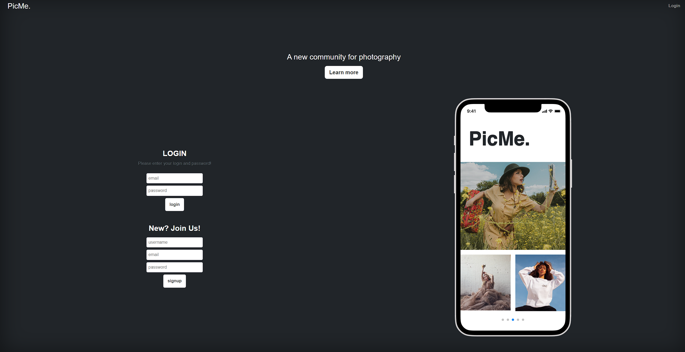

# Pic Me

## About this App

### Description

PicMe is the place for photographers and clients to connect to build new relationships and strengthen exisiting ones. We like to think of our community as a place where you can share ideas, collaborate with others, or learn about the latest news regarding the industry.

### User Story

As a user looking for a way to network with photographers, I would like an application that allows me to post about things regarding the industry, as well as interact with posts from other users. When I am on the homepage, I am presented with a list of users posts in an easy-to-navigate area.

### Features

* PicMe offers users full create, read, update, amd delete functionality so users to manage their posts.
* The application verifies users and hashes sensative information.
* PicMe currently displays content to users in a chronological order.

### Built With:

- JavaScript
- Node.JS
- Express.JS
- Bootstrap
- Handlebars.JS
- Heroku
- MySQL
- Sequelize
- Node NPM Packages

## Deployed Application

<a href="https://picme1.herokuapp.com/" target="_blank">Click here</a> to view this application.

## Installation

This program can be run through a browser using the above link to the deployed application. In order to run this program locally you will need to:

* Clone this repository to receive all the files.

## Screenshot

## Contributions

- Caleb Funderburk
- Dane Cronin
- Dejah Harris
- Connor Kelly
